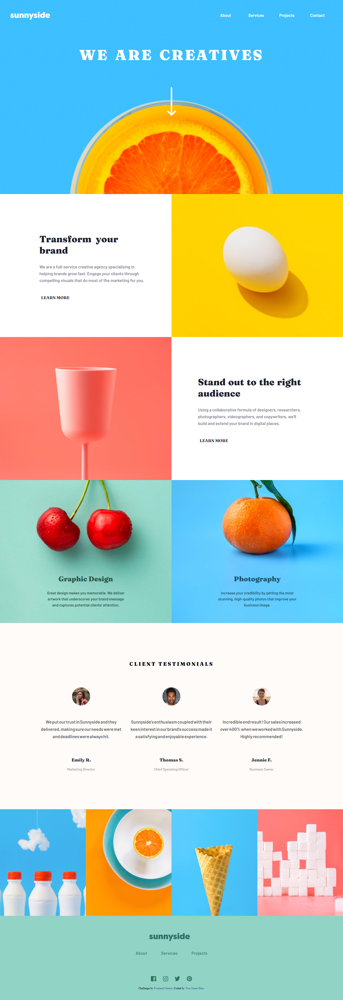

# Frontend Mentor - Sunnyside agency landing page solution

This is a solution to the [Sunnyside agency landing page challenge on Frontend Mentor](https://www.frontendmentor.io/challenges/sunnyside-agency-landing-page-7yVs3B6ef). Frontend Mentor challenges help you improve your coding skills by building realistic projects.

## Table of contents

- [Overview](#overview)
  - [The challenge](#the-challenge)
  - [Screenshot](#screenshot)
  - [Links](#links)
- [My process](#my-process)
  - [Built with](#built-with)
  - [Useful resources](#useful-resources)
- [Author](#author)

## Overview

### The challenge

Users should be able to:

- View the optimal layout for the site depending on their device's screen size
- See hover states for all interactive elements on the page

### Screenshot

<a href="./screenshot.jpg">Screenshot</a>

### Links

- Solution URL: [Add solution URL here](https://github.com/D7RSVN/sunnyside-agency-landing-page-main)
- Live Site URL: [Add live site URL here](https://cranky-edison-16859a.netlify.app/)

## My process

### Built with

- Semantic HTML5 markup
- CSS custom properties
- Flexbox
- Animation transition
- Mobile-first workflow

**Note: These are just examples. Delete this note and replace the list above with your own choices**

### Useful resources

- [Let's build a responsive navbar and hamburger menu using HTML, CSS, and Javascript.](https://dev.to/devggaurav/let-s-build-a-responsive-navbar-and-hamburger-menu-using-html-css-and-javascript-4gci) - This helped me to make navbar.
- [Simple CSS Line Hover Animations for Links](https://tympanus.net/codrops/2021/02/10/simple-css-line-hover-animations-for-links/) - This help me o make some hover with animation transition.

## Author

- Frontend Mentor - [@D7RSVN](https://www.frontendmentor.io/profile/D7RSVN)
- Git - [D7RSVN](https://github.com/D7RSVN)

